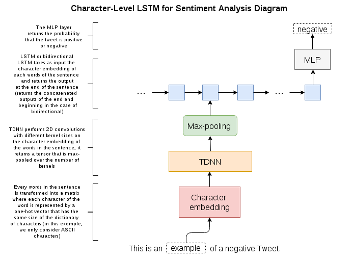

# Bidirectional Character LSTM for Sentiment Analysis 

### Requirements
- Python 2.7
- Tensorflow
- NLTK

### Setup
- Download the [datasets](http://help.sentiment140.com/for-students/) in `/datasets`
- Download the Tokenize module of NLTK using `nltk.download()`
- Change the `PATH` variable in [data_utils.py](https://github.com/charlesashby/CharLSTM/blob/master/lib/data_utils.py) and in the model files
- Train the model you want with `python main.py <MODEL_NAME> --train` 

### Using a Pretrained Model
This repository provides a pretrained model for the unidirectional LSTM you can test your own sentences using:

```
python main.py lstm --sentences 'sentence 1' 'sentence 2' 'etc...'
```

### Model



### Results
Both models were trained for more or less 80000 iterations (~ 5 epochs) and achieved similar accuracy on a test set of 80000 tweets, note that both models are neither affected by spelling mistakes or slang.

```
# (LSTM) Valid loss: 23.50035 -- Valid Accuracy: 0.83613
# (Bidirectional LSTM) Valid loss: 24.41145 -- Valid Accuracy: 0.82714

# Some examples...
"cant believe i still have to write an essay..", yielded (pos/neg): 0.03065/0.96935, prediction: neg
"Why are you concerned with people leaking information youve declassified?" , yielded (pos/neg):
  0.04639/0.95361, prediction: neg
"Virus is going in reverse now, god my guts hurt", yielded (pos/neg): 0.09748/0.90252, prediction: neg

# You can see it still has problem with sarcasm:
"his bravery?  Haha, you have to be kidding.", yielded (pos/neg): 0.73277/0.26723, prediction: pos

```

